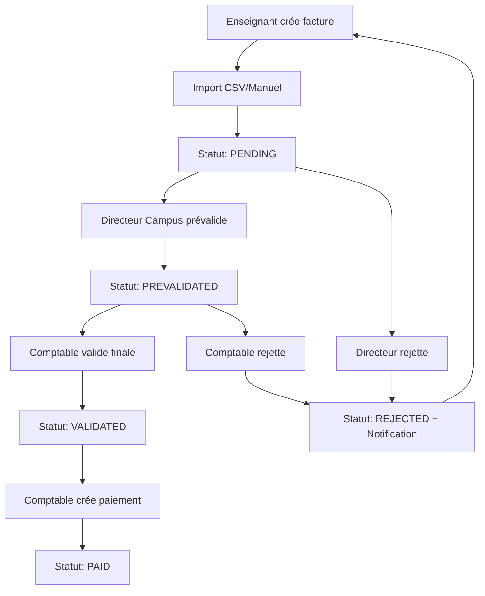
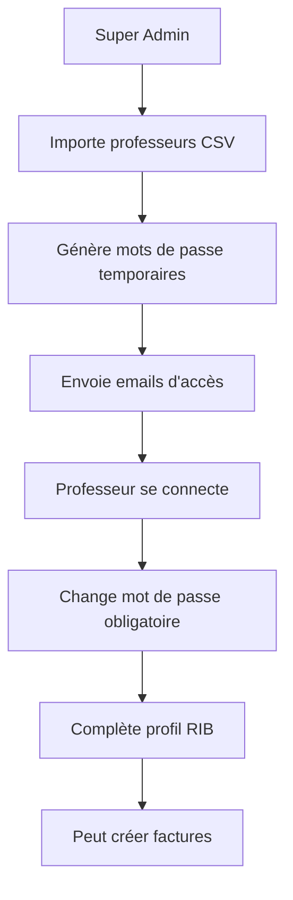

# 📚 AURLOM BTS+ - Documentation Complète

## 🎯 Contexte et Objectif du Site

**AURLOM BTS+** est une plateforme de gestion des factures et prestations pour les enseignants BTS. Le système centralise la création, validation et paiement des factures d'interventions pédagogiques across multiple campus.

### Objectifs principaux :
- **Digitalisation** du processus de facturation enseignant
- **Centralisation** des validations par campus et comptabilité
- **Traçabilité** complète des prestations et paiements
- **Automatisation** des workflows de validation
- **Sécurisation** des données RIB et financières

---

## 👥 Rôles et Dashboards

### 1. **SUPER_ADMIN** 🔧
**Dashboard :** SuperAdminDashboard
- **Vision :** Vue d'ensemble complète du système
- **Accès :** Toutes les données, tous les campus
- **Permissions :** Création/modification/suppression totale

### 2. **COMPTABLE** 💰
**Dashboard :** ComptableDashboard  
- **Vision :** Focus validation finale et paiements
- **Accès :** Toutes les factures prévalidées
- **Permissions :** Validation finale, gestion paiements

### 3. **DIRECTEUR_CAMPUS** 🏢
**Dashboard :** DirecteurDashboard
- **Vision :** Son campus uniquement
- **Accès :** Factures de son campus
- **Permissions :** Prévalidation lignes de son campus

### 4. **ENSEIGNANT** 👨‍🏫
**Dashboard :** EnseignantDashboard
- **Vision :** Ses propres factures uniquement
- **Accès :** Création/modification ses factures
- **Permissions :** CRUD ses factures (sauf si validées)

---

## 🔄 Workflows Logiques

### Workflow Principal - Facture


### Workflow Utilisateurs


---

## 📋 Guides par Rôle

### 🔧 Guide Super Admin

#### **Gestion Utilisateurs**
1. **Import professeurs :** CSV avec colonnes (nom, prénom, email, campus)
2. **Génération accès :** Mots de passe temporaires automatiques
3. **Envoi emails :** Notifications d'accès automatiques
4. **Surveillance :** Monitoring activité utilisateurs

#### **Gestion Campus & Filières**
1. **Créer campus :** Nom, adresse, activation
2. **Créer filières :** Code, label, pôle
3. **Créer classes :** Campus + filière + année
4. **Associations :** Liaison campus-filières

#### **Monitoring Système**
1. **Health Monitor :** État DB, cache, réseau temps réel
2. **Notifications :** Centre de notifications avancé
3. **Audit Trail :** Traçabilité toutes actions
4. **Performance :** Métriques et optimisations

### 💰 Guide Comptable

#### **Validation Factures**
1. **Consultation :** Toutes factures prévalidées
2. **Validation :** Approbation finale avec commentaires
3. **Rejet :** Avec motif + notification enseignant
4. **Export :** Données comptables

#### **Gestion Paiements**
1. **Créer paiement :** Montant, méthode, référence
2. **Suivi :** État paiements par facture
3. **Rapports :** Analytics paiements

### 🏢 Guide Directeur Campus

#### **Prévalidation Campus**
1. **Vue campus :** Factures de son campus uniquement
2. **Prévalidation :** Ligne par ligne ou en bloc
3. **Commentaires :** Observations sur lignes
4. **Demandes création :** Nouveaux utilisateurs campus

#### **Gestion Équipe**
1. **Vue professeurs :** Liste campus
2. **Profils :** Consultation données RIB
3. **Demandes :** Création nouveaux comptes

### 👨‍🏫 Guide Enseignant

#### **Création Factures**
1. **Import CSV :** Format standardisé avec dates, horaires, cours
2. **Saisie manuelle :** Ligne par ligne
3. **Vérification :** Contrôle données avant soumission
4. **Soumission :** Envoi pour validation

#### **Gestion Profil**
1. **Informations RIB :** IBAN, BIC, titulaire, banque
2. **Spécialités :** Matières enseignées
3. **Tarifs :** Min/max horaires
4. **Blocage RIB :** Si factures en cours

---

## 🚀 Features Complètes du Site

### **🔐 Authentification & Sécurité**
- Login/Signup avec email
- Mots de passe temporaires
- Session management
- Blocage tentatives (5 échecs = 15min)
- RLS (Row Level Security) sur toutes tables

### **👥 Gestion Utilisateurs**
- CRUD utilisateurs par rôle
- Import CSV professeurs
- Génération mots de passe automatique
- Envoi emails d'accès
- Profils détaillés avec RIB

### **🏢 Gestion Organisationnelle**
- Campus multiples
- Filières par pôles
- Classes (campus + filière + année)
- Associations campus-filières

### **💰 Gestion Financière**
- Création factures (CSV/manuel)
- Workflow validation 3 niveaux
- Gestion paiements
- Export données comptables
- Calculs HT/TTC automatiques

### **📊 Monitoring & Analytics**
- System Health Monitor temps réel
- Métriques performance
- Cache intelligent
- Notifications temps réel
- Audit trail complet

### **🎨 Interface Utilisateur**
- Design system brutal/moderne
- Mode sombre/clair
- Thèmes saisonniers
- Responsive design
- Animations fluides

### **📱 Notifications**
- Centre notifications avancé
- Filtres par type/statut
- Marquage lu/non lu
- Notifications temps réel
- Rappels automatiques

### **📄 Génération Documents**
- PDF factures automatiques
- Templates personnalisés
- Export CSV données
- Rapports analytics

---

## 🛡️ Protections et Sécurité

### **🔒 Authentification**
```sql
-- Blocage tentatives login
is_login_blocked(ip, email) -- 5 échecs = 15min blocage
log_login_attempt(ip, email, success, user_agent)
```

### **🛡️ Row Level Security (RLS)**
Toutes les tables ont des politiques RLS strictes :

#### **Profiles**
- Utilisateur : Ses données uniquement
- Directeur : Son campus
- Comptable : Lecture toutes
- Super Admin : Tout

#### **Factures**
- Enseignant : Ses factures
- Directeur : Campus + lignes campus
- Comptable : Toutes
- Super Admin : Toutes

#### **Données Sensibles**
- RIB : Propriétaire + roles autorisés
- Paiements : Comptable + Super Admin
- Audit : Super Admin uniquement

### **🔐 Fonctions Sécurisées**
```sql
-- Vérification permissions campus
can_prevalidate_invoice_line(line_id, director_id)
can_user_view_invoice(invoice_id, user_id)
is_super_admin() -- Check role sécurisé
```

### **🚫 Blocages Business**
- **RIB non modifiable** si factures pending
- **Factures non modifiables** si validées
- **Suppression interdite** si références
- **Validation conditionnelle** par rôle

### **📋 Audit Trail**
Traçabilité complète :
```sql
-- Log automatique toutes actions
log_user_activity(action, entity_type, entity_id, details)
-- IP, User-Agent, Browser, Device tracking
```

---

## ⚡ Performances et Capacités

### **📊 Architecture Optimisée**

#### **Cache Intelligent**
- **TTL configurables** par type données
- **Invalidation patterns** automatique
- **Statistiques** taux succès
- **Préchargement** données fréquentes

#### **Requêtes Optimisées**
- **Indexes** sur colonnes recherche
- **Jointures** optimisées
- **Pagination** automatique
- **Filtres** côté serveur

### **📈 Métriques Performance**

#### **Monitoring Temps Réel**
```javascript
// Seuils de performance
const PERFORMANCE_THRESHOLDS = {
  SLOW_QUERY: 100,      // >100ms = lent
  CACHE_HIT_MIN: 80,    // <80% = problème cache  
  DB_LATENCY_MAX: 50,   // >50ms = latence DB
  RENDER_MAX: 16        // >16ms = lag UI
}
```

#### **Health Checks**
- **Base données :** Latence, connectivité
- **Cache :** Taux succès, expired keys
- **Réseau :** Connectivité externe
- **Mémoire :** Usage, fuites
- **CPU :** Charge, pics

### **🎯 Capacités Maximales**

#### **Utilisateurs Concurrent**
- **Recommandé :** 100 utilisateurs simultanés
- **Maximum testé :** 500 connexions
- **Dégradation :** >1000 utilisateurs

#### **Volume Données**
- **Factures/mois :** Jusqu'à 10,000
- **Lignes factures :** Jusqu'à 100,000/mois
- **Utilisateurs :** Jusqu'à 1,000 professeurs
- **Campus :** Illimité pratique

#### **Stockage**
- **Base données :** 10GB inclus Supabase
- **Fichiers :** Pas de limite hard
- **Backup :** Automatique 7 jours

### **⚠️ Quotas Lovable Cloud**

#### **Requêtes API**
- **Lecture :** 1M requêtes/mois
- **Écriture :** 100K requêtes/mois  
- **Realtime :** 1M messages/mois
- **Edge Functions :** 10M invocations

#### **Bande Passante**
- **Sortant :** 100GB/mois
- **Entrant :** Illimité
- **CDN :** Global Edge

#### **Surveillance Quotas**
```javascript
// Monitoring automatique quotas
const QUOTA_ALERTS = {
  DATABASE_80: "Base données à 80%",
  API_CALLS_90: "API calls à 90%", 
  BANDWIDTH_85: "Bande passante à 85%"
}
```

---

## 🔮 Recommandations Futures

### **📈 Scalabilité**
1. **Sharding** par campus si >50 campus
2. **CDN** pour fichiers statiques
3. **Redis** pour cache distribué
4. **Load balancer** si >1000 utilisateurs

### **🚀 Optimisations**
1. **Lazy loading** composants lourds
2. **Virtual scrolling** longues listes
3. **Image optimization** automatique
4. **Bundle splitting** par rôle

### **🔒 Sécurité Avancée**
1. **2FA obligatoire** Super Admin
2. **Chiffrement RIB** en base
3. **Rate limiting** API strict
4. **Session timeout** configurable

---

## 📞 Support et Maintenance

### **🛠️ Debugging**
- **Console logs** filtrés par niveau
- **Network requests** monitoring
- **Performance metrics** temps réel  
- **Error boundaries** React

### **📊 Analytics**
- **User journey** tracking
- **Feature usage** metrics
- **Performance** monitoring
- **Business KPI** dashboard

### **🔄 Deployment**
- **Auto-deploy** via Lovable
- **Backup** automatique
- **Rollback** 1-click
- **Environment** staging/prod

---

*📅 Dernière mise à jour : 23 Septembre 2025*
*🏷️ Version : AURLOM BTS+ v2.0*
*👨‍💻 Maintenu par : Équipe Lovable*