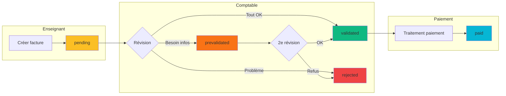
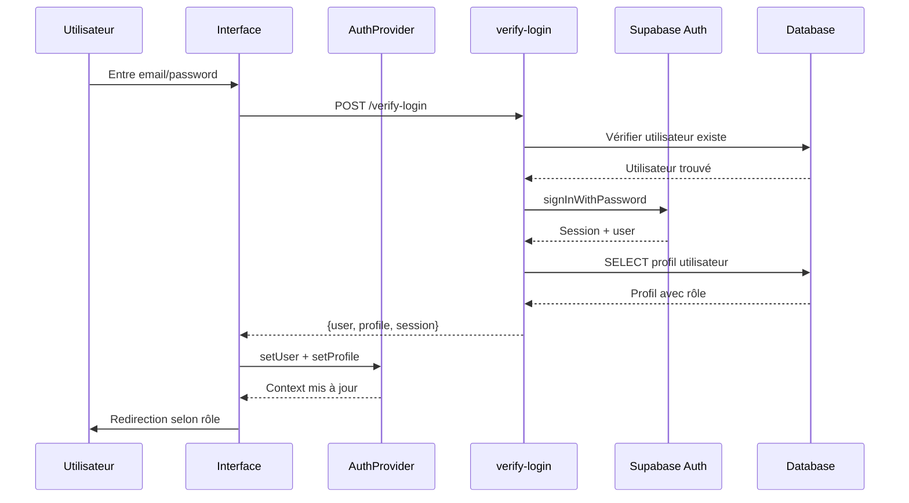
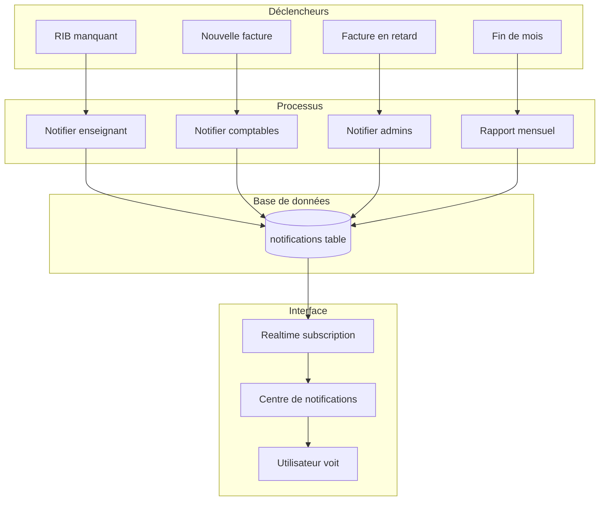
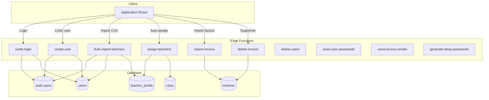
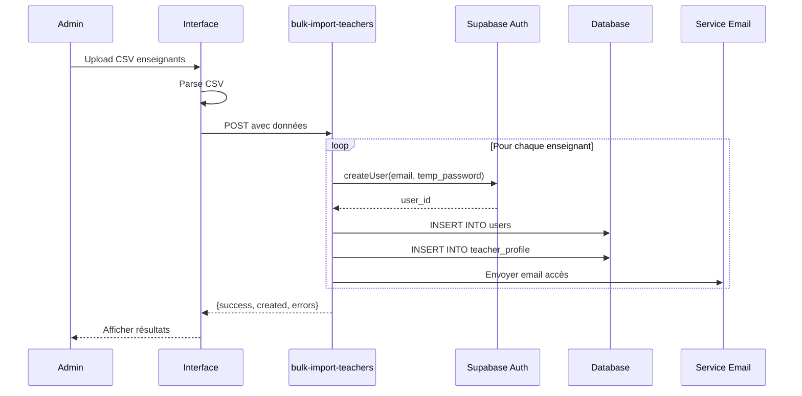

# Flowchart du Projet AURLOM BTS+ - Module Profs

## Architecture Globale du Système

```mermaid
flowchart TD
    Start([Utilisateur accède à l'application]) --> Auth{Authentifié?}
    
    Auth -->|Non| Login[Page de Login]
    Login --> VerifyLogin[verify-login Edge Function]
    VerifyLogin --> CheckCreds{Identifiants valides?}
    CheckCreds -->|Non| Login
    CheckCreds -->|Oui| LoadProfile[Charger le profil utilisateur]
    
    Auth -->|Oui| LoadProfile
    LoadProfile --> CheckRole{Quel rôle?}
    
    CheckRole -->|ENSEIGNANT| TeacherDash[Dashboard Enseignant]
    CheckRole -->|COMPTABLE| ComptaDash[Dashboard Comptable]
    CheckRole -->|DIRECTEUR| DirectorDash[Dashboard Directeur]
    CheckRole -->|SUPER_ADMIN| AdminDash[Dashboard Super Admin]
    
    %% Flux Enseignant
    TeacherDash --> TeacherActions{Action?}
    TeacherActions -->|Créer facture| CreateInvoice[Formulaire de création]
    CreateInvoice --> InvoiceType{Type de saisie?}
    InvoiceType -->|Import CSV| ImportCSV[InvoiceImportForm]
    InvoiceType -->|Saisie manuelle| ManualForm[ManualInvoiceForm]
    
    ImportCSV --> ParseCSV[Parser le CSV]
    ParseCSV --> ImportEdge[import-invoice Edge Function]
    ImportEdge --> SaveInvoice[(Sauvegarder dans DB)]
    
    ManualForm --> ValidateForm{Formulaire valide?}
    ValidateForm -->|Non| ManualForm
    ValidateForm -->|Oui| SaveInvoice
    
    SaveInvoice --> CheckRIB{RIB présent?}
    CheckRIB -->|Non| RibNotif[Notification RIB manquant]
    CheckRIB -->|Oui| InvoicePending[Statut: pending]
    
    TeacherActions -->|Voir mes factures| MyInvoices[Liste des factures]
    MyInvoices --> InvoiceDetails[Détails de la facture]
    InvoiceDetails --> DownloadPDF[Générer PDF]
    
    TeacherActions -->|Compléter profil| TeacherProfile[Formulaire profil enseignant]
    TeacherProfile --> UpdateRIB[Mettre à jour RIB/IBAN]
    UpdateRIB --> SaveProfile[(Sauvegarder dans teacher_profile)]
    
    %% Flux Comptable
    ComptaDash --> ComptaActions{Action?}
    ComptaActions -->|Valider factures| ValidationPage[Page de validation]
    ValidationPage --> ListPending[Liste factures pending/prevalidated]
    ListPending --> ReviewInvoice{Révision facture}
    ReviewInvoice -->|Prévalider| Prevalidate[Statut: prevalidated]
    ReviewInvoice -->|Valider| Validate[Statut: validated]
    ReviewInvoice -->|Rejeter| Reject[Statut: rejected + commentaire]
    
    ComptaActions -->|Gérer paiements| PaymentMgmt[Gestion des paiements]
    PaymentMgmt --> MarkAsPaid[Marquer comme payée]
    MarkAsPaid --> PaidStatus[Statut: paid]
    
    ComptaActions -->|Voir rapports| ComptaReports[Rapports comptables]
    ComptaReports --> MonthlyStats[Statistiques mensuelles]
    ComptaReports --> ExportData[Exporter données]
    
    %% Flux Directeur
    DirectorDash --> DirectorActions{Action?}
    DirectorActions -->|Gérer campus| CampusMgmt[Gestion des campus]
    DirectorActions -->|Gérer classes| ClassMgmt[Gestion des classes]
    DirectorActions -->|Voir factures campus| CampusInvoices[Factures du campus]
    DirectorActions -->|Statistiques| DirectorStats[Statistiques directeur]
    
    %% Flux Super Admin
    AdminDash --> AdminActions{Action?}
    AdminActions -->|Gérer utilisateurs| UsersMgmt[Gestion des utilisateurs]
    UsersMgmt --> UserActions{Action utilisateur?}
    UserActions -->|Créer| CreateUser[create-user Edge Function]
    UserActions -->|Modifier| UpdateUser[Modifier utilisateur]
    UserActions -->|Supprimer| DeleteUser[delete-users Edge Function]
    UserActions -->|Réinitialiser MDP| ResetPwd[reset-user-passwords Edge Function]
    
    AdminActions -->|Import enseignants| BulkImport[Formulaire import CSV]
    BulkImport --> ParseTeachers[Parser CSV enseignants]
    ParseTeachers --> BulkImportEdge[bulk-import-teachers Edge Function]
    BulkImportEdge --> CreateTeachers[(Créer utilisateurs + profils)]
    
    AdminActions -->|Assigner enseignants| AutoAssign[Auto-assignation]
    AutoAssign --> AssignEdge[assign-teachers Edge Function]
    AssignEdge --> MatchTeachers[Matcher avec classes]
    
    AdminActions -->|Gérer campus| AdminCampusMgmt[Gestion complète campus]
    AdminActions -->|Gérer filières| FiliereMgmt[Gestion des filières]
    AdminActions -->|Gérer classes| AdminClassMgmt[Gestion complète classes]
    AdminActions -->|Gérer directeurs| DirectorMgmt[Affectation directeurs]
    
    AdminActions -->|Thèmes saisonniers| SeasonalThemes[Gestion thèmes]
    AdminActions -->|Audit Trail| AuditTrail[Journal d'audit]
    AdminActions -->|Analytics avancées| Analytics[Analyses avancées]
    
    AdminActions -->|Toutes les factures| AllInvoices[Gestion globale factures]
    AllInvoices --> DeleteInvoice[delete-invoice Edge Function]
    
    %% Notifications système
    SaveInvoice --> TriggerNotif[Déclencheur notifications]
    TriggerNotif --> CheckNotifType{Type notification?}
    CheckNotifType -->|RIB manquant| NotifyTeacher[Notifier enseignant]
    CheckNotifType -->|Nouvelle facture| NotifyCompta[Notifier comptable]
    CheckNotifType -->|Facture en retard| NotifyAdmin[Notifier admin]
    
    %% Système de santé
    AdminDash --> HealthMonitor[Moniteur de santé système]
    HealthMonitor --> CheckHealth{État système?}
    CheckHealth --> DBHealth[Santé DB]
    CheckHealth --> AuthHealth[Santé Auth]
    CheckHealth --> StorageHealth[Santé Storage]
    
    style Start fill:#fbbf24
    style TeacherDash fill:#10b981
    style ComptaDash fill:#3b82f6
    style DirectorDash fill:#8b5cf6
    style AdminDash fill:#ef4444
    style SaveInvoice fill:#06b6d4
    style CreateTeachers fill:#06b6d4
```



## Flux de Validation des Factures



## Architecture des Données

```mermaid
erDiagram
    users ||--o| teacher_profile : "has one"
    users ||--o{ invoices : "creates"
    users ||--o{ user_activity_logs : "generates"
    users ||--o{ notifications : "receives"
    users }o--|| campus : "belongs to"
    
    teacher_profile ||--o{ teacher_classes : "teaches"
    teacher_classes }o--|| class : "references"
    
    class }o--|| campus : "belongs to"
    class }o--|| filiere : "belongs to"
    
    invoices ||--|{ invoice_lines : "contains"
    invoices }o--|| class : "references"
    invoices }o--|| campus : "references"
    
    campus ||--o{ campus_directors : "managed by"
    campus_directors }o--|| users : "references"
    
    users {
        uuid id PK
        string email
        string role
        uuid campus_id FK
        boolean is_active
    }
    
    teacher_profile {
        uuid id PK
        uuid user_id FK
        string rib_iban
        string address
        string phone
    }
    
    invoices {
        uuid id PK
        uuid teacher_id FK
        uuid class_id FK
        string status
        int month
        int year
        decimal total_amount
        jsonb metadata
    }
    
    invoice_lines {
        uuid id PK
        uuid invoice_id FK
        date course_date
        time start_time
        time end_time
        decimal hours
        string course_title
    }
    
    class {
        uuid id PK
        string name
        uuid campus_id FK
        uuid filiere_id FK
    }
    
    campus {
        uuid id PK
        string name
        string code
    }
    
    filiere {
        uuid id PK
        string name
        string code
    }
```

## Flux d'Authentification



## Système de Notifications



## Edge Functions Architecture



## Workflow Import d'Enseignants


